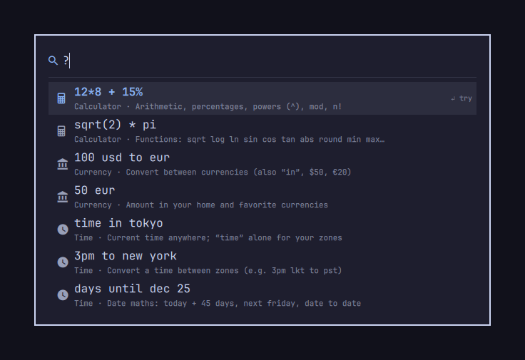

# Command Bar

A Spotlight-style command bar for Omarchy. Press a hotkey and type. Results appear as you type, and Enter copies or runs the selected one.



## What it does

| Type | Result |
|------|--------|
| `12*8 + 15%`, `sqrt(2)`, `15% of 200`, `5!` | Calculator |
| `100 usd to eur`, `$50`, `50 gbp`, `usd jpy` | Currency conversion, using rates from [open.er-api.com](https://open.er-api.com) |
| `time`, `time in tokyo`, `3pm cet to pst` | Time zones |
| `days until dec 25`, `today + 45 days`, `next friday` | Date calculations |
| `:fire`, `emoji party` | Emoji search. Enter types the emoji into the app you were using |
| `kill`, `kill chrome`, `kill -9 node` | Quit one of your processes, or all processes with that name |
| `g …`, `yt …`, `gh …`, `wiki …`, `lock` | Keyword commands, which you can change in the config |

Type part of a feature's name to find it: `emo` shows Search Emoji, `curr` shows Convert Currency. Type `?` to see everything.

Keys:

- Up/Down or Ctrl+N/P: move the selection
- Enter: copy, open or run the selected row
- Tab: complete a keyword
- Esc: clear the text; press again to close

The bar remembers your last query. When you reopen it, the text is selected, so typing replaces it.

## Install

```sh
omarchy plugin add https://github.com/Saikomantisu/omarchy-commandbar --enable
```

Add these lines to `~/.config/hypr/bindings.lua` to set up the hotkey:

```lua
local commandbar = os.getenv("HOME") .. "/.config/omarchy/plugins/io.github.saikomantisu.commandbar/hypr/commandbar.lua"
local commandbar_file = io.open(commandbar)
if commandbar_file then commandbar_file:close(); dofile(commandbar) end
```

The hotkey is Super + Period. You can change it with `"hotkey"` in the config.

To open the bar with text already filled in, pass a query. For example, to open emoji search directly:

```sh
omarchy-shell shell toggle io.github.saikomantisu.commandbar '{"query": ":"}'
```

### Dependencies

All of these come with Omarchy:

- `curl`: exchange rates
- `wl-copy` (from `wl-clipboard`): copying results
- `xdg-open`: web keyword commands
- `ps` and `kill` (from `procps-ng`): the process list
- `date` and `timedatectl`: time zones
- `hyprctl`: applying a new hotkey
- `omarchy-menu-emoji-insert` and Omarchy's `emojis.json`: emoji

### Network, files and processes

- The only network request is to `https://open.er-api.com/v6/latest/USD`, made when you convert currency and the saved rates are out of date. The rates update once a day. What you type is not sent anywhere, except the text you search with a web keyword like `g`.
- It writes only to `~/.cache/omarchy-commandbar/`: the saved rates and your last query. It does not change your Hyprland or Omarchy config files.
- When you change `"hotkey"`, it runs `hyprctl reload config-only`.
- It lists only your own processes, and quits one only when you press Enter on it.

## Remove

```sh
omarchy plugin remove io.github.saikomantisu.commandbar
rm -rf ~/.cache/omarchy-commandbar ~/.config/omarchy/extensions/commandbar.json
```

Then delete the three hotkey lines from `~/.config/hypr/bindings.lua`. If you leave them, they do nothing once the plugin is removed.

## Configure

Put your settings in `~/.config/omarchy/extensions/commandbar.json`. They override the defaults in [`config.default.json`](config.default.json), and changes apply when you save. You can use comments and trailing commas.

```jsonc
{
  // A Hyprland key combination. "" means no hotkey.
  "hotkey": "SUPER + PERIOD",
  // Features to turn on. When results score equally, earlier ones come first.
  "providers": ["commands", "math", "currency", "time", "emoji", "processes"],
  // Default home currency is USD. "rupee" and "rs" mean your home currency
  // if it is a rupee, otherwise INR.
  "currency": { "home": "EUR", "favorites": ["USD", "GBP"] },
  // Default home zone is your system time zone.
  "time": { "home": "Europe/Berlin", "zones": ["UTC", "America/New_York"], "clock24": true },
  // "paste" types the emoji into the app you were using; "copy" copies it.
  "emoji": { "onEnter": "paste" },
  // This list replaces the default keyword commands.
  "commands": [
    { "keyword": "g", "title": "Search Google", "open": "https://www.google.com/search?q={q}" },
    { "keyword": "ddg", "title": "DuckDuckGo", "open": "https://duckduckgo.com/?q={q}" },
    { "keyword": "term", "title": "Terminal", "run": "xdg-terminal-exec" },
    { "keyword": "say", "title": "Notify", "run": "notify-send {q}" }
  ]
}
```

`{q}` is whatever you type after the keyword. In `open` commands it is URL-encoded. In `run` commands it is shell-quoted, so it can't change the command itself.

## Adding a feature

Each feature is a JavaScript file in `providers/`:

```js
.pragma library

var provider = {
  id: "units",
  name: "Units",
  icon: "󰕒",
  // Found by name: typing "unit" shows this command.
  commands: [{ title: "Convert Units", keywords: "unit convert", text: "e.g. 5 km to mi", complete: "5 km to mi", select: true }],
  // Shown in the "?" list.
  help: [{ title: "Units", examples: ["5 km to mi", "30c to f"] }],
  // Return [] if the query isn't for this feature.
  match: function(query, ctx) {
    return [{ title: "3.11 mi", subtitle: "5 km → mi", score: 80, copy: "3.11" }]
  }
}
```

A result can include `run: { kind: "open" | "run", target }` to open or run something on Enter. `ctx.settings` is the provider's section of the config. `ctx` also has `rates`, `zones`, `localZone`, `emojis`, `processes`, `now()`, `format(n)` and `plain(n)`.

To enable it, import it in [`providers/index.js`](providers/index.js), add it to the list there, and add its `id` to `"providers"` in the config.

Test providers without the shell by running `node tests/run.js`.

## License

MIT
