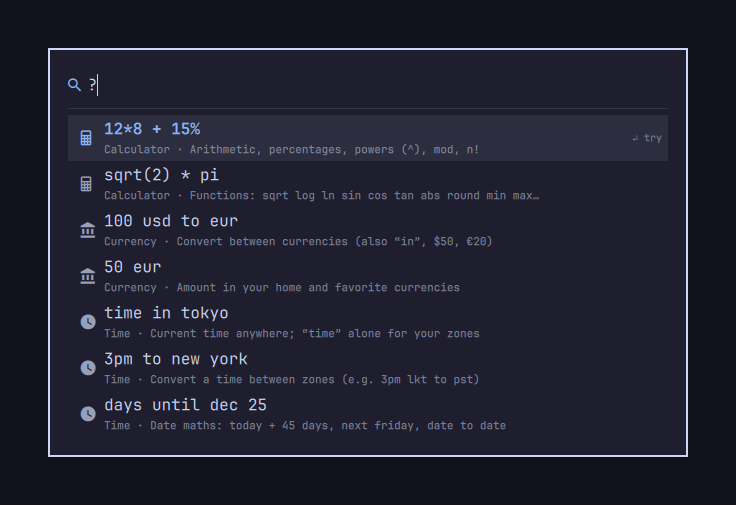

<p align="center">
  
</p>

<h1 align="center">Command Bar</h1>

<p align="center">
  <b>A Spotlight-style command bar for Omarchy.</b><br>
  Open apps, switch windows, do maths, convert currencies and units, check time zones,
  find emoji, quit processes and ask your AI agent, all from <b>Super + Period</b>.
</p>

<p align="center">
  <a href="https://plugins.omarchy.org/plugin.html?id=io.github.saikomantisu.commandbar"><picture><source media="(prefers-color-scheme: dark)" srcset="https://shieldcn.dev/badge/Omarchy-plugin-18181b.svg?logo=omarchy&variant=secondary&mode=dark" /></picture></a>
  <a href="manifest.json"><picture><source media="(prefers-color-scheme: dark)" srcset="https://shieldcn.dev/badge/dynamic/json.svg?url=https%3A%2F%2Fraw.githubusercontent.com%2FSaikomantisu%2Fomarchy-commandbar%2Fmain%2Fmanifest.json&query=%24.version&label=version&logo=false&variant=secondary&mode=dark" /></picture></a>
  <a href="https://github.com/Saikomantisu/omarchy-commandbar/stargazers"><picture><source media="(prefers-color-scheme: dark)" srcset="https://shieldcn.dev/github/stars/Saikomantisu/omarchy-commandbar.svg?variant=secondary&mode=dark" /></picture></a>
  <a href="LICENSE"><picture><source media="(prefers-color-scheme: dark)" srcset="https://shieldcn.dev/github/license/Saikomantisu/omarchy-commandbar.svg?variant=secondary&mode=dark" /></picture></a>
</p>

<p align="center">
  <a href="#install">Install</a> ·
  <a href="#features">Features</a> ·
  <a href="#configure">Configure</a> ·
  <a href="#privacy">Privacy</a> ·
  <a href="#contributing">Contributing</a>
</p>

## Install

```sh
omarchy plugin add https://github.com/Saikomantisu/omarchy-commandbar --enable
```

Then press **Super + Period** to open it. Everything it needs comes with Omarchy.

## Features

| Feature | Try typing |
|---------|------------|
| Calculator | `12*8 + 15%` |
| Currency | `100 usd to eur` |
| Units | `5 km to mi` |
| Time zones | `time in tokyo` |
| Dates | `days until dec 25` |
| Apps and windows | `firefox`, `w github` |
| Emoji | `:fire` |
| Processes | `kill chrome` |
| Your AI agent | `ai why is my wifi slow` |
| Keyword commands | `g …`, `yt …`, or your own |

Type `?` in the bar for help and examples for every feature.

<table>
  <tr>
    <th>Open an app</th>
    <th>Switch window</th>
    <th>Kill a process</th>
  </tr>
  <tr valign="top">
    <td></td>
    <td></td>
    <td></td>
  </tr>
</table>

## Configure

Put your settings in `~/.config/omarchy/extensions/commandbar.json`. They override the defaults in [`config.default.json`](config.default.json), and changes apply when you save.

```jsonc
{
  "hotkey": "SUPER + PERIOD",
  "currency": { "home": "EUR", "favorites": ["USD", "GBP"] }
}
```

> [!WARNING]
> `ai` starts your Omarchy agent with its auto-approve setting, so the agent runs commands without asking. The row says so before you press Enter.

## Privacy

- The only network request is for exchange rates, at most once a day. What you type isn't sent anywhere, except web keyword searches like `g` and prompts you give your agent with `ai`.
- It writes only to `~/.cache/omarchy-commandbar/` and never changes your Hyprland or Omarchy config files.
- Its hotkey is set in the running Hyprland and removed with the plugin.

## Remove

```sh
omarchy plugin remove io.github.saikomantisu.commandbar
rm -rf ~/.cache/omarchy-commandbar ~/.config/omarchy/extensions/commandbar.json
```

## Contributing

See [CONTRIBUTING.md](CONTRIBUTING.md).

## License

MIT
